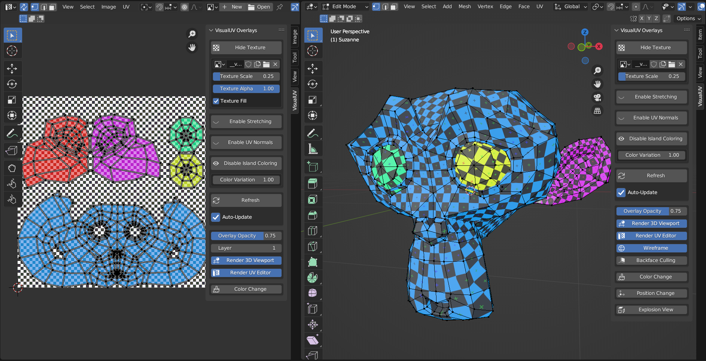
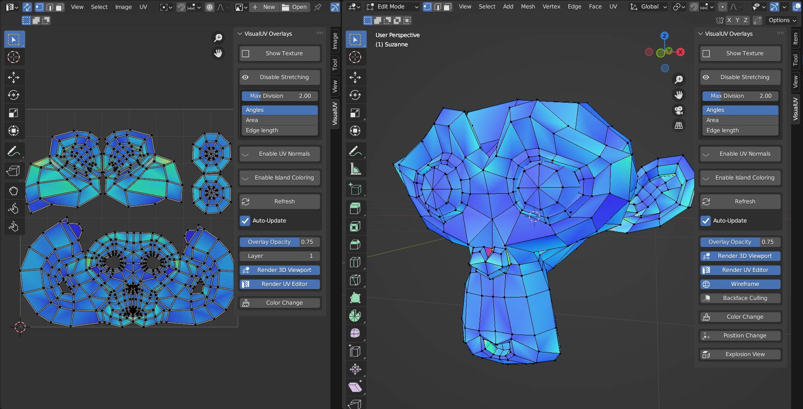
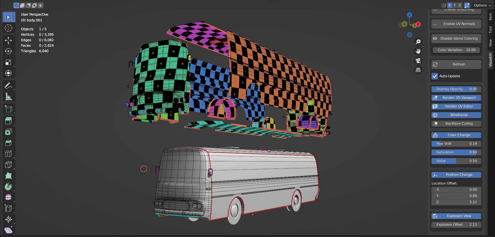

# VisualUV

This Blender add-on offers several customizable 3D Viewport and UV Editor overlays for visualizing common issues in UV Maps, like UV Streching, Flipping, and Overlapping. The addon is accessible from a panel in the tools section of the 3D Viewport and the UV Editor.
>You need Blender of version at least 3.5.

# Main features

This is the list of the main features offered by this add-on.

## Quick texture preview

Overlay for previewing image textures with just one click. The default Grid texture can be switched to any other image loaded in your workspace. You can change the scale and alpha of the texture. This overlay can be combined with all other VisualUV's overlays

## UV Stretching

This overlay works similarly to Blender's default UV Stretching Visualization but is also displayed on the original model in the 3D Viewport. You can choose between visualizing stretching of faces by angles, areas and edge length.

## UV Normals

This overlay colors the UV Faces depending on the direction of their normals.

## UV Overlapping

This overlay uses Blender's feature for selecting overlapping UVs, but additionally colors them both in the UV Editor and the 3D Viewport.
> This feature is only available in the Edit-Mode and with Synchronized UV Selection turned-off.

> This feature needs to be manualy refreshed to visualize correct information.

## Colored UV Islands

Overlay for coloring each UV Island with a distinct color.

# Customization

After turning on any VisualUV overlay, you will be get access to several customization options.

## Refresh and Auto-Update

VisualUV by default refreshes after every **button release** and **mouse click**. Working with models of thousands of polygons can become unpleasant, with constant stuttering as VisualUV recalculates visual information about the geometry. The **Auto-Update** feature can be turned off, and all overlays can be refreshed manualy be a designated button. The **Refresh** button also serves as a quick **restart**, as some operations in Blender may internaly crash the overlays.

## Wireframe

A wireframe shader is turned on by default and is visible in Edit-Mode.
>Turning off this option boost performance.

## Position and Color Change

Turning on these options let's you modify the position and colors of the overlay.

## Explosion View

This feature will let you divide the overlay into individual UV Islands and allowing you to offset them away from the center.

